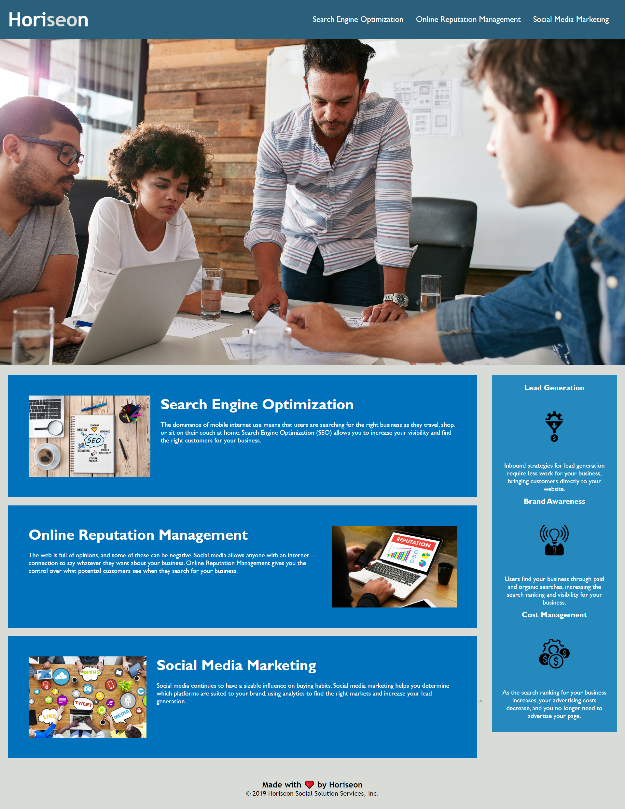

# Horiseon Refactoring

## Table of Contents

- [Challenge](#challenge)
- [Description](#Description)
- [Screenshot](#screenshot)
- [links](#links)
- [Contact](#contact)

## Challenge

This task involved sorting out the code into semantic html and also consolidating the css also add comments.

## Description

```
GIVEN a webpage meets accessibility standards
WHEN I view the source code
THEN I find semantic HTML elements
WHEN I view the structure of the HTML elements
THEN I find that the elements follow a logical structure independent of styling and positioning
WHEN I view the icon and image elements
THEN I find accessible alt attributes
WHEN I view the heading attributes
THEN they fall in sequential order
WHEN I view the title element
THEN I find a concise, descriptive title
```.

## Screenshots

### This is the before image
 


### This is the after image
 
 

# links

- [github](github) 
- [deployed](deployed)


## Contact Me

You can reach me on [here](anis94@live.co.uk)

visit my github [here](https://github.com/annishassan)